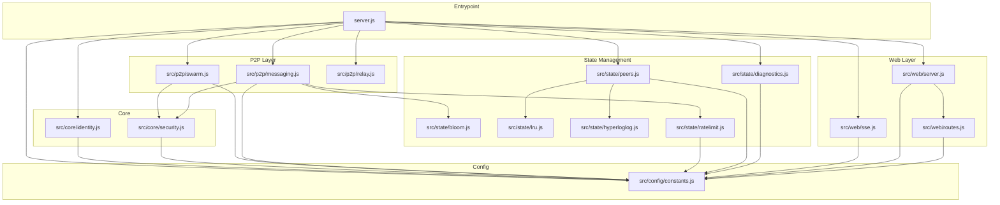
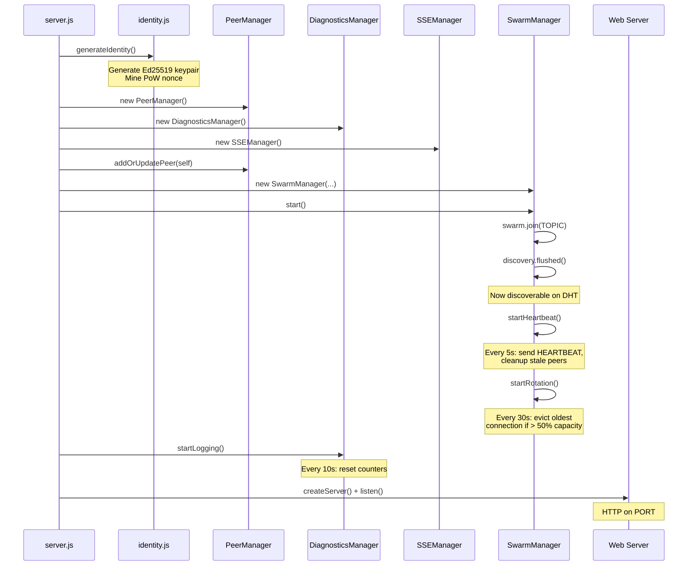
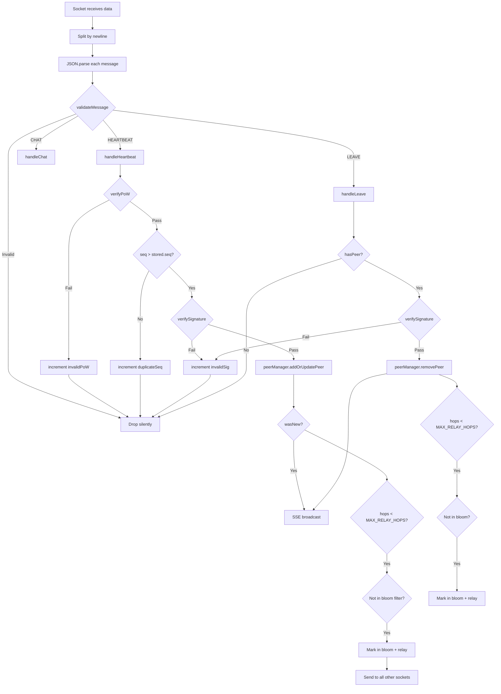
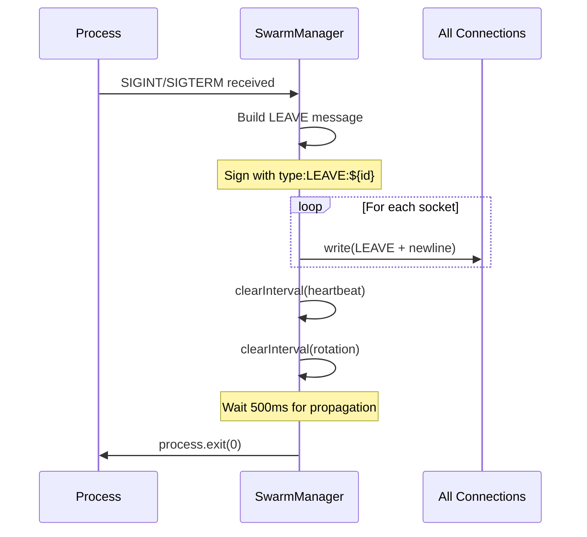

# AGENTS.md — Hypermind Knowledge Base

> **Purpose**: Deep runbook for AI coding agents working on this repository.  
> Covers architecture, protocol, invariants, safe modification patterns, and debugging.

---

## Table of Contents

1. [Project Summary](#project-summary)
2. [Environment Variables](#environment-variables)
3. [Quickstart](#quickstart)
4. [Repository Map](#repository-map)
5. [Module Dependency Graph](#module-dependency-graph)
6. [Runtime Architecture](#runtime-architecture)
7. [Protocol Details](#protocol-details)
8. [Timing Relationships](#timing-relationships)
9. [Connection Lifecycle](#connection-lifecycle)
10. [Security Model](#security-model)
11. [State Model](#state-model)
12. [Web/API Surface](#webapi-surface)
13. [Frontend Notes](#frontend-notes)
14. [DO NOT CHANGE](#do-not-change)
15. [Common Change Patterns](#common-change-patterns)
16. [Debugging & Troubleshooting](#debugging--troubleshooting)
17. [Manual Verification Checklist](#manual-verification-checklist)

---

## Project Summary

**Hypermind** is a completely decentralized, peer-to-peer deployment counter built on the [Hyperswarm](https://github.com/holepunchto/hyperswarm) DHT.

### What it does

- Counts how many nodes are currently running Hypermind across the internet.
- Nodes discover each other via DHT, exchange heartbeats, and maintain a local peer list.
- Provides a real-time web dashboard showing the swarm size.
- **Ephemeral P2P Chat**: Nodes can exchange signed, rate-limited chat messages via gossip.
- **Peer Map**: Visualize peer locations on a world map via IP geolocation.

### What it intentionally does NOT do

- **No persistence**: All state is ephemeral. Restart = fresh start.
- **No central authority**: No master node, no database, no coordination server.
- **No user data**: Nodes only share their existence, nothing else.

### License

MIT — see `LICENSE` file.

---

## Environment Variables

| Variable | Default | Description |
|----------|---------|-------------|
| `PORT` | `3000` | Web dashboard HTTP port |
| `MAX_PEERS` | `1000000` | Maximum peers to track in LRU cache |
| `ENABLE_CHAT` | `false` | Enable ephemeral P2P chat feature |
| `RELAY_PORT` | - | Connect to TCP relay server for local testing (bypasses DHT) |

Most are read in `src/config/constants.js`. `RELAY_PORT` is read directly in `src/p2p/swarm.js`.

---

## Quickstart

### Local Development

```bash
# Install dependencies
npm install

# Run the node
npm start

# Or with custom port
PORT=3000 npm start

# With chat enabled
ENABLE_CHAT=true PORT=3000 npm start
```

### Multi-Node Local Testing

```bash
# Terminal 1
PORT=3000 npm start

# Terminal 2
PORT=3001 npm start
```

Both nodes should discover each other within ~5 seconds and show count = 2.

### Local Testing with TCP Relay (WSL2/Docker)

If DHT discovery fails (common in WSL2, Docker, or corporate networks), use the TCP relay:

```bash
# Terminal 1 - Start relay server
node relay-server.js

# Terminal 2 - Node 1
RELAY_PORT=4000 ENABLE_CHAT=true PORT=3000 node server.js

# Terminal 3 - Node 2
RELAY_PORT=4000 ENABLE_CHAT=true PORT=3001 node server.js
```

> **Note**: Use `node server.js` directly instead of `npm start` to ensure environment variables pass correctly.

### Docker

```bash
docker run -d \
  --name hypermind \
  --network host \
  --restart unless-stopped \
  -e PORT=3000 \
  ghcr.io/lklynet/hypermind:latest
```

> **CRITICAL**: Use `--network host`. Hyperswarm requires direct UDP/TCP access for DHT hole-punching. Bridge networking will isolate your node.

### Docker Compose

```yaml
services:
  hypermind:
    image: ghcr.io/lklynet/hypermind:latest
    container_name: hypermind
    network_mode: host
    restart: unless-stopped
    environment:
      - PORT=3000
```

---

## Repository Map

| File/Directory | Responsibility |
|----------------|----------------|
| `server.js` | Entrypoint — wires all managers together, starts swarm and HTTP server |
| `src/config/constants.js` | All tunable values, timing intervals, limits, env var parsing |
| `src/core/identity.js` | Ed25519 keypair generation + Proof-of-Work nonce mining |
| `src/core/security.js` | PoW verification, message signing, signature verification |
| `src/p2p/swarm.js` | Hyperswarm lifecycle, heartbeat loop, connection rotation, TCP relay |
| `src/p2p/messaging.js` | Message validation and dispatch (HEARTBEAT/LEAVE/CHAT handlers) |
| `src/p2p/relay.js` | Gossip relay — forwards messages to all sockets except source |
| `src/state/ratelimit.js` | Chat rate limiter (burst + cooldown) |
| `relay-server.js` | TCP relay server for local testing when DHT fails |
| `src/state/peers.js` | PeerManager — LRU cache of peers + HyperLogLog unique estimate |
| `src/state/bloom.js` | Time-bucketed bloom filter for relay deduplication |
| `src/state/diagnostics.js` | Metrics counters, reset every DIAGNOSTICS_INTERVAL |
| `src/state/lru.js` | Simple LRU cache implementation |
| `src/state/hyperloglog.js` | Cardinality estimator (precision=10, ~3% standard error) |
| `src/web/server.js` | Express app factory |
| `src/web/routes.js` | HTTP routes: `/`, `/events`, `/api/stats`, `/api/chat` |
| `src/web/sse.js` | Server-Sent Events manager with broadcast throttling |
| `public/index.html` | Dashboard HTML template (server-side variable injection) |
| `public/app.js` | Frontend JS — SSE client, particle visualization, diagnostics modal, chat UI, map |
| `public/style.css` | Dashboard styling |
| `Dockerfile` | Production container image |
| `docker-compose.yml` | Production compose config |
| `docker-compose.dev.yml` | Development compose config (builds locally) |

---

## Module Dependency Graph



**Key insight**: Changing `constants.js` ripples to 10+ files. Always grep for constant usage before modifying.

---

## Runtime Architecture

### Startup Flow



### Message Flow (Inbound)



### Shutdown Flow



---

## Protocol Details

### Message Types

#### HEARTBEAT

Announces node liveness. Sent on connection and every `HEARTBEAT_INTERVAL`.

```json
{
  "type": "HEARTBEAT",
  "id": "<hex-encoded DER public key>",
  "seq": 42,
  "hops": 0,
  "nonce": 12345,
  "sig": "<hex-encoded Ed25519 signature>"
}
```

| Field | Type | Description |
|-------|------|-------------|
| `type` | string | Always `"HEARTBEAT"` |
| `id` | string | Node identity (public key as hex) |
| `seq` | number | Monotonically increasing sequence number |
| `hops` | number | Relay hop count (0 = direct from source) |
| `nonce` | number | PoW nonce that satisfies `POW_PREFIX` |
| `sig` | string | Signature of `seq:${seq}` |

#### LEAVE

Announces graceful departure. Sent on shutdown.

```json
{
  "type": "LEAVE",
  "id": "<hex-encoded DER public key>",
  "hops": 0,
  "sig": "<hex-encoded Ed25519 signature>"
}
```

| Field | Type | Description |
|-------|------|-------------|
| `type` | string | Always `"LEAVE"` |
| `id` | string | Node identity |
| `hops` | number | Relay hop count |
| `sig` | string | Signature of `type:LEAVE:${id}` |

#### CHAT

Ephemeral chat message. Sent via `/api/chat` endpoint, relayed through gossip.

```json
{
  "type": "CHAT",
  "id": "<hex-encoded DER public key>",
  "nick": "optional_nickname",
  "msg": "message content",
  "ts": 1704326400000,
  "hops": 0,
  "nonce": 12345,
  "sig": "<hex-encoded Ed25519 signature>"
}
```

| Field | Type | Description |
|-------|------|-------------|
| `type` | string | Always `"CHAT"` |
| `id` | string | Node identity (public key as hex) |
| `nick` | string/null | Optional nickname (alphanumeric, max 16 chars) |
| `msg` | string | Message content (max 140 chars) |
| `ts` | number | Timestamp (ms since epoch, for deduplication) |
| `hops` | number | Relay hop count (0 = direct from source) |
| `nonce` | number | PoW nonce (same as identity nonce) |
| `sig` | string | Signature of `chat:${msg}:${ts}` |

**Rate Limiting**: 2s minimum cooldown, 5 messages per 30s burst window.

**Relay**: Chat messages relay with same `MAX_RELAY_HOPS` as heartbeats.

**Bloom Key**: `${id}:chat:${ts}` for deduplication.

### Message Framing

- Messages are **newline-delimited JSON** (`\n` terminated).
- Multiple messages may arrive in a single `data` event.
- Maximum message size: `MAX_MESSAGE_SIZE` (2048 bytes).

### Relay Rules

1. On valid message receipt, increment `hops`.
2. Only relay if `hops < MAX_RELAY_HOPS` (default: 2).
3. Check bloom filter: skip if already relayed `${id}:${seq}` or `${id}:leave`.
4. Mark in bloom filter, then forward to all connected sockets except source.

### Sequence Number Semantics

- `seq` is per-node, incremented on each heartbeat send.
- Receivers **reject** messages where `seq <= stored.seq` (replay/stale protection).
- This is NOT a global ordering — just per-peer freshness.
- Prevents replay attacks and reduces duplicate processing.

---

## Timing Relationships

| Constant | Value | Semantic Meaning |
|----------|-------|------------------|
| `HEARTBEAT_INTERVAL` | 5000ms | How often we announce liveness |
| `PEER_TIMEOUT` | 15000ms | 3 missed heartbeats = stale, evicted |
| `DIAGNOSTICS_INTERVAL` | 10000ms | Stats window; counters reset |
| `BROADCAST_THROTTLE` | 1000ms | Min interval between SSE pushes |
| `CONNECTION_ROTATION_INTERVAL` | 30000ms | Evict oldest connection if > 50% capacity |
| Bloom rotation (hardcoded) | 30000ms | Matches connection rotation |
| `CHAT_MIN_COOLDOWN` | 2000ms | Minimum time between chat messages |
| `CHAT_BURST_LIMIT` | 5 | Max messages per burst window |
| `CHAT_BURST_WINDOW` | 30000ms | Burst window duration |

**Critical relationship**: `PEER_TIMEOUT` should be ~3× `HEARTBEAT_INTERVAL`. This ensures a peer is only considered stale after 3 missed heartbeats.

---

## Connection Lifecycle

1. **New connection**: If `connections.size > MAX_CONNECTIONS` (32), immediately destroy.
2. **Stamping**: Each socket gets `connectedAt = Date.now()`.
3. **Hello**: Immediately send HEARTBEAT to new peer.
4. **Rotation**: Every 30s, if connections > 16, destroy the oldest socket.
5. **Close handling**: Remove `socket.peerId` from peer list, broadcast update.
6. **Error handling**: Silent — `socket.on("error", () => {})`.

---

## Security Model

### Identity

- Generated at startup via `crypto.generateKeyPairSync("ed25519")`.
- `id` = hex-encoded DER SPKI format of public key.
- Private key never leaves the process.

### Proof of Work

```javascript
// Mining (identity.js)
while (true) {
  const hash = sha256(id + nonce);
  if (hash.startsWith(POW_PREFIX)) break;  // "0000"
  nonce++;
}

// Verification (security.js)
const powHash = sha256(id + nonce);
return powHash.startsWith(POW_PREFIX);
```

- `POW_PREFIX` = `"0000"` (4 leading zeros).
- Makes Sybil attacks expensive — each fake identity requires mining.

### Signatures

- **HEARTBEAT**: Signs `seq:${seq}` with Ed25519.
- **LEAVE**: Signs `type:LEAVE:${id}` with Ed25519.
- **CHAT**: Signs `chat:${msg}:${ts}` with Ed25519.
- Verification derives public key from `id` (it IS the public key).

### What is NOT secured

- **Payload encryption**: Messages are plaintext (gossip is public info).
- **Transport encryption**: Hyperswarm handles this at the connection level.

---

## State Model

### PeerManager (`src/state/peers.js`)

```javascript
{
  seenPeers: LRUCache(MAX_PEERS),  // id → { seq, lastSeen, ip }
  uniquePeersHLL: HyperLogLog(10), // Cardinality estimator
  mySeq: 0                         // Our sequence counter
}
```

- **LRU eviction**: When at capacity, oldest-accessed peer is evicted.
- **Stale cleanup**: On each heartbeat, remove peers where `now - lastSeen > PEER_TIMEOUT`.
- **HyperLogLog**: Tracks total unique peers ever seen (precision=10 → ~3% error).
- **IP tracking**: Stores peer IP for map visualization.

### BloomFilterManager (`src/state/bloom.js`)

```javascript
{
  currentBloom: BloomFilter(10000, 3),
  previousBloom: BloomFilter(10000, 3)
}
```

- **Rotation**: Every 30s, `previous = current`, `current = new BloomFilter()`.
- **Check**: `hasRelayed(id, seq)` checks both filters.
- **Purpose**: Prevents re-relaying the same message within ~60s window.

### DiagnosticsManager (`src/state/diagnostics.js`)

Tracks per-interval metrics:

| Counter | Meaning |
|---------|---------|
| `heartbeatsReceived` | Total HEARTBEAT messages received |
| `heartbeatsRelayed` | Messages forwarded to other peers |
| `invalidPoW` | Failed PoW verification |
| `duplicateSeq` | Rejected due to stale/duplicate seq |
| `invalidSig` | Failed signature verification |
| `newPeersAdded` | New unique peers discovered |
| `bytesReceived` | Total bytes received |
| `bytesRelayed` | Total bytes forwarded |
| `leaveMessages` | LEAVE messages processed |

All counters reset every `DIAGNOSTICS_INTERVAL` (10s).

### ChatRateLimiter (`src/state/ratelimit.js`)

Used in `routes.js` for API-level rate limiting:

```javascript
{
  senders: Map()  // id → { timestamps: [], lastMessage: ts }
}
```

- **Cooldown check**: Rejects if `now - lastMessage < CHAT_MIN_COOLDOWN`.
- **Burst check**: Rejects if 5+ messages in last 30s window.
- **Cleanup**: Stale sender data removed when `lastMessage > 2 * CHAT_BURST_WINDOW`.

Note: The ChatRateLimiter is instantiated directly in `routes.js` for local API rate limiting.

---

## Web/API Surface

### Routes (`src/web/routes.js`)

| Endpoint | Method | Response |
|----------|--------|----------|
| `/` | GET | Server-rendered HTML dashboard |
| `/events` | GET | SSE stream (text/event-stream) |
| `/api/stats` | GET | JSON snapshot |
| `/api/chat` | POST | Send chat message `{ msg }` → `{ success }` |

### SSE Payload (`/events`)

```json
{
  "count": 42,
  "totalUnique": 150,
  "direct": 5,
  "id": "302a300506032b6570...",
  "diagnostics": {
    "heartbeatsReceived": 100,
    "heartbeatsRelayed": 80,
    ...
  }
}
```

- Pushed on peer changes and every `DIAGNOSTICS_INTERVAL`.
- Throttled: minimum 1s between broadcasts.

### SSE Chat/System Messages (`/events`)

Chat and system messages are broadcast via the same SSE stream as regular updates:

```json
{
  "type": "CHAT",
  "sender": "302a...",
  "nick": "alice",
  "content": "hello",
  "timestamp": 1704326400000
}
```

```json
{
  "type": "SYSTEM",
  "content": "Connection established with Node ...abc12345",
  "timestamp": 1704326400000
}
```

- Chat messages broadcast via `sseManager.broadcast()`.
- System messages sent on peer connect/disconnect (when ENABLE_CHAT is true).

### Static Assets

Served from `public/` directory:
- `index.html` — Template with `{{COUNT}}`, `{{ID}}`, `{{DIRECT}}` placeholders
- `app.js` — SSE client, particle animation, diagnostics modal, chat, map
- `style.css` — Dark theme styling

---

## Frontend Notes

### `public/app.js`

- **SSE Client**: `new EventSource("/events")` — auto-reconnects on error.
- **Particle Visualization**: Canvas-based, capped at `VISUAL_LIMIT = 500` particles.
- **Diagnostics Modal**: Toggle via "diagnostics" link, shows live metrics.
- **Map Modal**: Toggle via "map" link, shows peer locations using Leaflet.
- **Chat Terminal**: Minimizable terminal-style panel for chat.
- **Nickname Storage**: `localStorage.getItem('hypermind_nick')` — persists across sessions.
- **Chat Messages**: Received via SSE `onmessage` handler (type: CHAT or SYSTEM).
- **No console.error on SSE errors**: Intentional — auto-reconnect makes logging spammy.

### Bandwidth Formatter

```javascript
// KB → MB → GB thresholds
if (gb >= 1) return gb.toFixed(2) + ' GB';
else if (mb >= 1) return mb.toFixed(2) + ' MB';
else return kb.toFixed(1) + ' KB';
```

---

## DO NOT CHANGE

### Hard Invariants

These changes will break compatibility with the existing network:

| Invariant | Location | Why |
|-----------|----------|-----|
| `TOPIC` derivation | `constants.js` | `sha256("hypermind-lklynet-v1")` — changing orphans your node |
| `POW_PREFIX` | `constants.js` | Changing from `"0000"` causes network split until all nodes upgrade. See code comment. |
| Newline framing | `swarm.js`, `relay.js` | Messages MUST be `\n`-terminated; receivers split on `\n` |
| Signature payload: HEARTBEAT | `swarm.js`, `messaging.js` | Must sign `seq:${seq}` |
| Signature payload: LEAVE | `swarm.js`, `messaging.js` | Must sign `type:LEAVE:${id}` |
| Signature payload: CHAT | `routes.js`, `messaging.js` | Must sign `chat:${msg}:${ts}` |

### Intentional Code Patterns

Do NOT "fix" these — they are deliberate:

| Pattern | Location | Reason |
|---------|----------|--------|
| Empty catch on socket errors | `swarm.js` | Sockets error frequently; logging is noise |
| No `console.error` on SSE errors | `public/app.js` | Auto-reconnects; logging is spammy |
| Silent JSON parse failures | `swarm.js` | Malformed messages should be dropped silently |
| 500ms shutdown delay | `swarm.js` | Gives LEAVE messages time to propagate |
| No explicit error handling in relay | `relay.js` | Socket errors handled at connection level |

---

## Common Change Patterns

### Adding a New Message Type

1. **Define schema** in `messaging.js` → `validateMessage()`:
   ```javascript
   if (msg.type === "NEW_TYPE") {
     const allowedFields = ['type', 'id', 'yourField', 'sig'];
     // ... validation
   }
   ```

2. **Add signature convention** — document what string is signed.

3. **Add handler** in `MessageHandler` class:
   ```javascript
   handleNewType(msg, sourceSocket) {
     // Verify signature, process, optionally relay
   }
   ```

4. **Update bloom key** if relaying:
   ```javascript
   this.bloomFilter.hasRelayed(id, "newtype")
   ```

5. **Add diagnostics counter** if tracking.

### Changing Timing Constants

- **Respect 3× relationship**: `PEER_TIMEOUT ≈ 3 × HEARTBEAT_INTERVAL`.
- **Keep rotation aligned**: Bloom rotation (30s) and connection rotation (30s) should match.
- **Test locally**: Run 2+ nodes, verify discovery and stale cleanup timing.

### Modifying `constants.js`

1. **Grep for usage** first — constants are imported in 10+ files.
2. **Check ripple effects**:
   - `TOPIC` → affects network isolation
   - `POW_PREFIX` → affects identity mining + verification
   - Intervals → affect timing relationships

### Adding API Endpoints

Add to `src/web/routes.js` in `setupRoutes()`:

```javascript
app.get("/api/newEndpoint", (req, res) => {
  res.json({ /* ... */ });
});
```

For streaming, follow the `/events` SSE pattern.

---

## Debugging & Troubleshooting

| Symptom | Likely Cause | How to Check |
|---------|--------------|--------------|
| Count stuck at 1 | No peer discovery | Verify `--network host` in Docker; check firewall/NAT; try TCP relay |
| No direct connections | DHT not reaching peers | Use TCP relay: `node relay-server.js` + `RELAY_PORT=4000` |
| High `invalidPoW` | Attacker or incompatible node version | Normal if <10% of heartbeats; investigate if higher |
| High `invalidSig` | Message tampering or signature bug | Check signature payload format matches |
| SSE not updating | Throttle or no clients | Confirm `/events` connection in browser DevTools; check `BROADCAST_THROTTLE` |
| Peers disappearing fast | `PEER_TIMEOUT` too short | Should be ~3× `HEARTBEAT_INTERVAL` |
| Memory growing | Too many peers / no cleanup | Check `MAX_PEERS` limit; verify stale cleanup runs |
| Chat not working locally | DHT discovery fails on WSL2/Docker | Use TCP relay instead of DHT |
| Chat messages not received | Nodes not connected to each other | Check `direct` count in `/api/stats`; use relay |

### Diagnostic Tools

1. **Web Dashboard**: `http://localhost:3000` — shows count + direct connections.
2. **Diagnostics Modal**: Click "diagnostics" link on dashboard.
3. **Map Modal**: Click "map" link on dashboard to see peer locations.
4. **API Endpoint**: `curl http://localhost:3000/api/stats | jq`.
5. **Console Output**: Node logs startup ID and port.

---

## Manual Verification Checklist

Use this after making changes:

- [ ] `npm install && PORT=3000 npm start` — node starts, shows ID
- [ ] Open `http://localhost:3000` — count shows 1, particle appears
- [ ] `PORT=3001 npm start` in second terminal — both show count 2 within ~5s
- [ ] Stop node 2 (Ctrl+C) — count drops to 1 within ~15s (`PEER_TIMEOUT`)
- [ ] `curl http://localhost:3000/api/stats` — JSON with `count`, `direct`, `diagnostics`
- [ ] Open diagnostics modal — counters update every 10s
- [ ] Open map modal — shows peer locations
- [ ] Graceful stop (Ctrl+C) on node 1 — LEAVE sent, clean shutdown

### Chat Verification (with TCP Relay)

- [ ] `node relay-server.js` — relay starts on port 4000
- [ ] `RELAY_PORT=4000 ENABLE_CHAT=true PORT=3000 node server.js` — node 1 connects to relay
- [ ] `RELAY_PORT=4000 ENABLE_CHAT=true PORT=3001 node server.js` — node 2 connects to relay
- [ ] Both nodes show `direct: 1` in `/api/stats`
- [ ] Chat terminal is visible — send message from node 1
- [ ] Node 2 receives message in chat terminal
- [ ] Rapid messages get rate limited

### Docker Verification

- [ ] `docker build -t hypermind .` — builds successfully
- [ ] `docker run --network host -e PORT=3000 hypermind` — runs with host networking
- [ ] Dashboard accessible at `http://localhost:3000`

---

## Quick Reference

### Key Files to Read First

1. `server.js` — understand the wiring
2. `src/config/constants.js` — all the magic numbers
3. `src/p2p/swarm.js` — P2P lifecycle, TCP relay support
4. `src/p2p/messaging.js` — message handling (HEARTBEAT/LEAVE/CHAT)
5. `src/state/ratelimit.js` — chat rate limiting logic
6. `relay-server.js` — TCP relay for local testing

### Message Signature Quick Reference

| Message Type | Signed String |
|--------------|---------------|
| HEARTBEAT | `seq:${seq}` |
| LEAVE | `type:LEAVE:${id}` |
| CHAT | `chat:${msg}:${ts}` |

### Default Ports & Limits

| Setting | Default |
|---------|---------|
| Web port | 3000 |
| Relay port | 4000 (when using TCP relay) |
| Max peers | 1,000,000 |
| Max connections | 32 |
| Max message size | 2048 bytes |
| Max relay hops | 2 |
| Max chat message length | 140 chars |
| Max nickname length | 16 chars |
